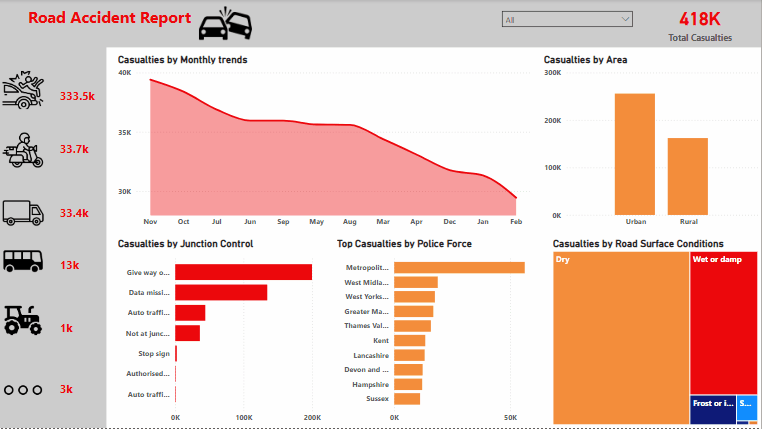

# SQL TO POWER BI- Road accident report




# Table of contents

- [Project brief](#Projectbrief)
- [Objective](#Objective)
- [Key Questions to Answer](#KeyQuestionstoanswer)
- [Data source](#Datasource)
- [Tools](#Tools)
- [Dashboard design charts](#Dashboarddesignchart)
- [Stages](#Stages)
- [Data processing & Transformation](#Datacleaning&processing)
- [Insights](#Insights)
- [Recommendations](#Recommendations)
- [Action Plan](Actionplan)


# Project Brief 
Road Accident Reports

## Project Overview
This project objective is to analyze an accident report dataset to uncover patterns and insights related to road safety. It includes trends in accident frequency, locations, times, and causes. The goal is to help improve decision-making and reduce future accidents through data-driven insights.

## Key Questions to Answer

1.	What is the total number of casualties?
2.	What are the total casualties by accidents severities?
3.	Compute the percentage by casualties.
4.	What road condition does accident mostly occurs?
5.	Accident occurs frequently in what light condition?
6.	What road type does accident mostly occurs?
7.	What area does accident mostly occurs?
8.	What weather condition does accident mostly occurs?
9.	What are the casualty rates by junction control?
10.	Compute the number of casualties caused by police force?
11.	How often does accident occurs monthly?
12.	What year has the highest casualties? 


## Data Source

## Tools

| Tools | Purpose | 
| --- | --- | 
| SQL |  Cleaning, Transformation, Processing |
| POWER BI | DAX Measures, Visualizations | 


## Dashboard Design
Here are the different (appropriate) chart and icons used in telling the data story.

1.	Score cards
2.	Column chart
3.	Donut chart
4.	Area chart
5.	Icons (cars, motorcycle, van, bus, agricultural vehicle and Others.)
6.	Bar chart
7.	Tree map
   


## Stages
Here’s a step-by-step details on how the data was approached 

1.	Get Data
2.	Load into SQL
3.	Clean and process with SQL
4.	Export to Power BI for visualizations
5.	Generate Insights
6.	Give recommendations
7.	Take action plan

## Data Cleaning & Processing 
Here's how the data was cleaned and processed before its readiness for analysis.

``` sql

-- Total Casualties
WITH Road AS ( SELECT CAST(number_of_casualties AS FLOAT) AS Casualties             
FROM [Road Accident Report Cleaned] )  SELECT SUM(Casualties) AS Totalcasualties 
FROM Road;

``` 


```sql

-- What are the total casualties by accidents severities?

WITH Road AS ( SELECT accident_severity, CAST(number_of_casualties AS FLOAT) AS Casualties            
FROM [Road Accident Report Cleaned] )  SELECT accident_severity, SUM(Casualties) AS AccidentSeverity FROM Road
GROUP BY Accident_Severity ;

```


```sql

-- Compute the percentage by casualties

WITH Road AS ( SELECT accident_severity, CAST(number_of_casualties AS DECIMAL (10,2)) AS Casualties            
FROM [Road Accident Report Cleaned] )  SELECT accident_severity, CAST(100.0 * COUNT(*)   / SUM(COUNT(*)) OVER() AS DECIMAL (10,2))  AS 'AccidentSeverity%' FROM Road
WHERE Accident_Severity IN ('Fatal', 'Serious', 'Slight')
GROUP BY Accident_Severity
ORDER BY 
CASE Accident_Severity	WHEN  'Fatal' THEN 1					
				WHEN  'Slight' THEN 2
				WHEN  'Serious' THEN 3
				END ;
```


```sql 

-- What road condition does accident mostly occurs?

WITH Road AS ( SELECT Road_Surface_Conditions, CAST(number_of_casualties AS FLOAT) AS Roadcondition            
FROM [Road Accident Report Cleaned] )  SELECT Road_Surface_Conditions, SUM(Roadcondition) AS AccidentSeverity FROM Road
GROUP BY Road_Surface_Conditions ;

```


```sql

-- In What light condition does accident mostly occur?

WITH Road AS ( SELECT Light_Conditions, CAST(number_of_casualties AS FLOAT) AS lightcondition            
FROM [Road Accident Report Cleaned] )  SELECT Light_Conditions, SUM(lightcondition) AS AccidentSeverity FROM Road
GROUP BY Light_Conditions ;

```


```sql

-- What road type does accident mostly occurs?

WITH Road AS ( SELECT Road_Type, CAST(number_of_casualties AS FLOAT) AS roadtype            
FROM [Road Accident Report Cleaned] )  SELECT Road_Type, SUM(roadtype) AS AccidentSeverity FROM Road
GROUP BY Road_Type ;

```


```sql

-- What area does accident mostly occurs?

WITH Road AS ( SELECT Urban_or_Rural_Area, CAST(number_of_casualties AS FLOAT) AS areacasualties            
FROM [Road Accident Report Cleaned] )  SELECT Urban_or_Rural_Area, SUM(areacasualties) AS AccidentSeverity FROM Road
GROUP BY Urban_or_Rural_Area ;

```


```sql

-- What weather condition does accident mostly occurs?

WITH Road AS ( SELECT Weather_Conditions, CAST(number_of_casualties AS FLOAT) AS weathercondition           --- Categorization by weather condition
FROM [Road Accident Report Cleaned] )  SELECT Weather_Conditions, SUM(weathercondition) AS AccidentSeverity FROM Road
GROUP BY weather_Conditions ;

```


```sql

-- What are the casualty rates by junction control?

WITH JunctionCasualties AS ( SELECT Junction_Control, CAST(number_of_casualties AS FLOAT) AS JunctionControl           --- Casualties by junction control
FROM [Road Accident Report Cleaned] )  SELECT Junction_Control, SUM(JunctionControl) AS AccidentSeverity FROM JunctionCasualties
GROUP BY Junction_Control
ORDER BY AccidentSeverity DESC ;

```


```sql

-- Casualties caused by police force?

WITH PoliceCasualties AS ( SELECT Police_Force, CAST(number_of_casualties AS FLOAT) AS PoliceCausedCasualties            --- casualties by police force
FROM [Road Accident Report Cleaned] )
SELECT TOP 10 Police_Force, SUM(PoliceCausedCasualties) AS AccidentSeverity FROM PoliceCasualties
GROUP BY Police_Force
ORDER BY AccidentSeverity DESC;

```


```sql

-- Calculate the sum of monthly casualties?

WITH MonthCasualties AS ( SELECT  DATENAME(Month, Accident_Date) AS MonthName,  
CAST(number_of_casualties AS FLOAT) AS monthcasualties	
FROM [Road Accident Report Cleaned] )  SELECT MonthName, SUM(monthcasualties) AS AccidentSeverity 
FROM MonthCasualties
GROUP BY MonthName
ORDER BY AccidentSeverity DESC; ---total casualties by month

```


```sql

-- What year is with the most casualties? 

WITH YearCasualties AS ( SELECT  DATEPART(Year, Accident_Date) AS AccidentYear, 
CAST(number_of_casualties AS FLOAT) AS monthcasualties					
FROM [Road Accident Report Cleaned] )  SELECT AccidentYear, SUM(monthcasualties) AS AccidentSeverity FROM YearCasualties
GROUP BY AccidentYear
ORDER BY AccidentSeverity DESC;  --- total casualties by year

```


## Insights

•	Cars account for the overwhelming majority of casualties (333.5K out of 418K).

•	Motorcycles and vans follow, but at much lower numbers.

•	Most casualties occur on single carriageway roads.

•	Dual carriageways and roundabouts also have notable numbers.

•	Accidents mostly occur during fine weather with no high winds.

•	Around 73% of accidents happen in darkness, suggesting visibility plays a major role.

•	Majority of accidents are slight (85.49%), but serious (13.23%) and fatal (1.28%) still make up a concerning share.

•	November sees the highest monthly casualties, with a gradual decline until February.

•	This may correlate with shorter daylight hours or weather conditions.

•	Urban areas have more casualties than rural areas, likely due to higher traffic density.

•	Most casualties occur at 'Give way or uncontrolled' junctions.

•	Poor or missing data on junction control also contributes to high accident counts.

•	Majority of accidents happen on dry roads, followed by wet or damp surfaces.


## Recommendations

•	Focus safety campaigns and infrastructure improvements in urban areas, especially targeting car users.

•	Since most accidents occur in darkness, increase the use of reflective signs, better street lighting, and vehicle visibility regulations.

•	Redesign or control 'Give way' junctions more effectively, possibly adding traffic signals or roundabouts.

•	Promote defensive driving programs especially in fine weather, as driver overconfidence may lead to accidents.

•	Add rumble strips, barriers, or speed calming measures on single carriageways to reduce risks.

•	Launch public awareness and enforcement campaigns in late autumn (Oct–Nov) when accidents spike.


## Action Plan

•	Audit and improve road safety in high-casualty urban zones.

•	Install better lighting in high-incident dark areas.

•	Analyze top dangerous junctions and upgrade control measures.

•	Seasonal campaigns about safe driving in good weather & dark hours.

•	Review policies for single carriageways and car safety.


